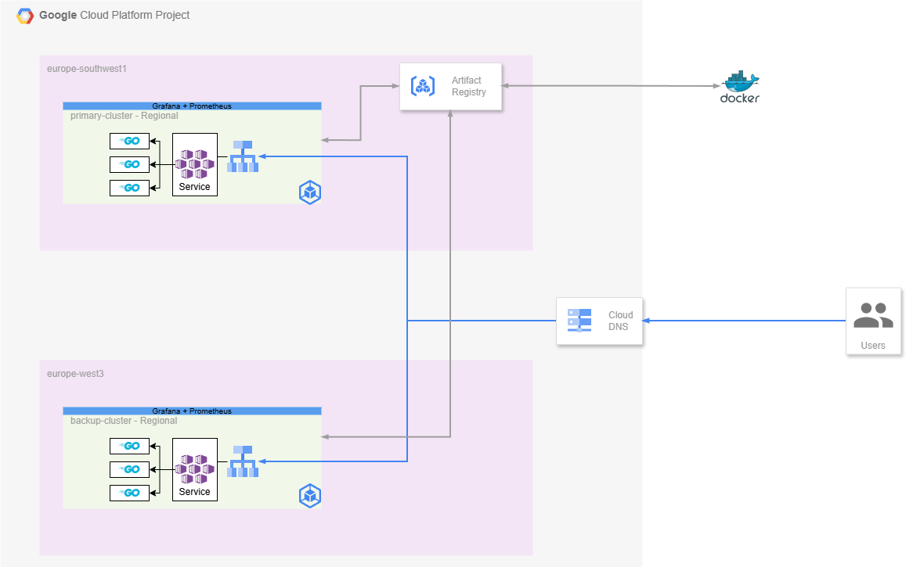

## Part 1 - Infrastructure

### Assumptions
- No strict SLAs have been indicated. Based on the given instructions, I'm assuming a **99.999%** availability is required.
- Given that the maximum coverage of a GKE cluster is regional, two clusters will be used to fulfill the multi-region failover architecture.
- GCP Architectural Best Practices will be followed up to the maximum extent applicable.
- Security at its core, without creating a lot of mess. (More on this on Part 3)

### Diagram

### Architecture reasoning:

Since there is a requirement to implement a multi-region failover, I believe this is best exercised by having a primary cluster (which we'll call primary-cluster) and a backup one, which is expected to be "warm" (this is, with a small node pool and the replicas for every deployment set to 0). This way, we can return to normal operations in a couple of minutes.

The clusters will be of "regional" kind, located within 3 zones. I've chosen europe-southwest1 as the main region since I believe it's best for this company, as the main userbase is in spain. The backup one wouldn't make sense to reside in the same location, and as such I've chosen europe-west3, which is in Germany, across EU and compliant with data residency guidelines.

The golang application will be deployed through the pipeline, and will run within the 3 zones. A service of "LoadBalancer" kind will be applied in front of the application, to:

1. Manage the incoming connections and distribute the load evenly within the pods, and
2. Ensure that we have a single IP to access.

This will be applied in both clusters, and we'll make use of split DNS zones, which, using a healthcheck pointing to the primary cluster load balancer, we'll decide whether to point traffic to the backup or not.

Regarding the cluster's configuration, although this will be explained further in section 3, I've configured the cluster to be private to reduce the attack surface, which means that the nodes will not have an external IP. For the sake of simplicity and not knowing the allowed IP ranges, I've left intentionally public the access to the control plane, and a NAT gateway will ensure that the image repos can be reached, although the use of PGA + PSC would be advised.

In regards with the monitoring stack, I'll use Grafana + Prometheus, both installed directly with Helm + Terraform. I've reconfigured the repos to be able to access them without internet through a proxy repo in Artifact Registry.

In regards of the kind of GKE cluster selected, I've chosen the standard type, as it allows a faster scale up on both the primary and the backup cluster, although, should it be cost-prohibitive, an autopilot cluster on the backup side would save some budget when scaled to 0, since it's pay per resources consumed.

(See the sample terraform.tfvars for ease of use).
### Alternative designs

I'd like to throw some ideas on how we could do different architectures:

- Less 9's: Instead of having a warm cluster, we could use a second one with autopilot. This way we'll pay only for the resources used, at the cost of slower deployments (since Google recalculates the nodepools behind the curtain).
- Same 9's, 2 active clusters: We could use the fleet's functionality with [multi-cluster ingress](https://cloud.google.com/kubernetes-engine/docs/concepts/multi-cluster-ingress) if all of the clusters are meant to primary ones (like an EU-US cluster). This would require an admin cluster and thus, more infrastructure maintenance efforts.

### Autoscaling
The application, as is, is a very simple hello world application. If we were to autoscale based on metrics that are not CPU usage, I'd recommend one of the following ways:

- Analyze traffic / requests to see if they're a feasible metric: We could have an application that calculates 100M digits of pi. The traffic would be small, CPU usage would be extreme.
- If we want to autoscale based on external events (like, amount of unacked messages in a PubSub topic), then we would have to use [KEDA](https://keda.sh/).

As of now and in order to complete this task, I'd suggest scaling based on requests and/or active connections using the built-in HPA, which supports [custom metrics](https://cloud.google.com/kubernetes-engine/docs/tutorials/autoscaling-metrics).

### RTO targets

Since we're operating under the assumption of being SLA 99.999% compliant (where the defintion of "unavailability" is being totally unavailable, not degraded performance), here are some targets that I would impose into this infrastructure:

| Failure Scenario           | RTO Target | Justification                                                                                           |
|-----------------------------|-------------|----------------------------------------------------------------------------------------------------------|
| Primary Cluster Failure     | 2 minutes  | Warm standby cluster with DNS failover. Health checks detect failure in ~30s, DNS propagation + pod scaling takes ~90s. |
| Zone Failure                | 30 seconds | Regional cluster automatically redistributes workload across remaining zones.                            |
| Pod/Container Failure       | 10 seconds | Kubernetes liveness probes and automatic pod restart.                                                    |
| Load Balancer Failure       | 1 minute   | GCP automatically provisions new load balancer endpoint.                                                 |
| Application Deployment Issue| 5 minutes  | Rollback deployment using previous container image version. (Automated with GitOps / CICD pipeline)                                             |                                     |

### RPO targets

In regards with the maximum data loss that we could allow, I've drafted the following targets:

| Data Type           | RPO Target              | Justification                                                                 |
|----------------------|-------------------------|--------------------------------------------------------------------------------|
| Application State    | 0 seconds (Zero Data Loss) | The app as-is is stateless, thus no data could be lost.
| Configuration Data   | 0 seconds               | Infrastructure as Code (Terraform) stored in Git.                              |
| Monitoring/Logs      | 2-5 minutes                | Logs buffered in Prometheus/Grafana. It is acceptable to lose recent metrics.        |
| Container Images     | 0 seconds               | Images stored in Artifact Registry with multi-region replication.              |
| Secrets              | 0 seconds               | Google Secret Manager with automatic replication.                              |

Should we have databases:

1. We should have the database outside of any cluster. For example, Cloud SQL can manage multi-region reliability on a much more easier way that we could do automatically.
2. In case we have it in the cluster, it should be replicated (at minimum, with the PVC, at maximum with a direct connection) and the primary/backup role should be transferred seamlessly.

