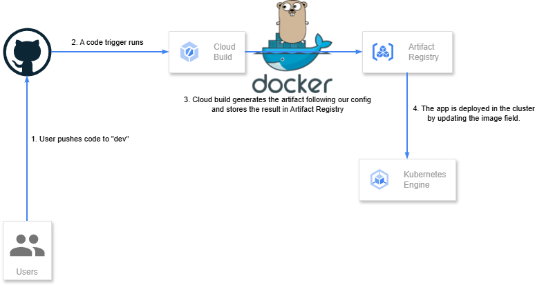

## Part 2 - The application

### The build tool
I've used Cloud Build since I'm more familiar with it and has a good ease of use with Kubernetes. Nonetheless, this could also be done with GitHub actions should this be required.

### The workflow

The idea was to preserve the go app as if it was inmutable: All changes required should go outside.

In order to successfully build the app, we'll need to init the go.mod dependencies. This would be done with: `go mod init app`. After this, we could prepare:

1. The Dockerfile
2. The cloudbuild.yaml
3. The nginx.conf for the proxy.

This will be a multi-step build process:

1. Build the Go app.
2. Containerize it with Docker and Nginx as proxy.
3. Push into our artifact repo.
4. Deploy to GKE.

### The trigger

We should configure as many triggers as we would need. In order to fulfill the requirements of this exercise, I'm going to state 2:

#### Canary release
For any commit pushed to the branch "development".

#### Prod release
For any commit pushed to the branch "master" (This includes branch merges). In order to ensure a 4-eyes policy it would be good to configure the trigger to only build if another user approves, or, alternatively, use some sort of branch protection in the source repo.

### Rollbacks
If we were to use any GitOps tool like ArgoCD, the same tool would ensure that if the pod is crashing, it would be restored to the previous version.

Alternatively, there are 2 manual ways:
1. Perform a code rollback and commit it: This would trigger a new build.
2. Access cloud build and rebuild the previous submission.

### HTTPS traffic
In order to properly serve HTTPS traffic in port 443, we would need an nginx proxy in front of the app, and we would generate the self-signed cert using openssl (more on this in the Dockerfile).

